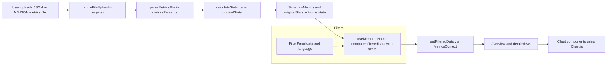
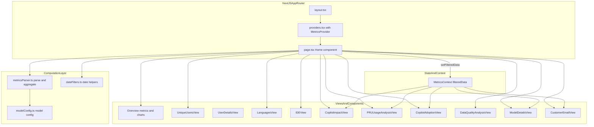

# GitHub Copilot User Level Metrics Viewer

This document explains the purpose, data format, architecture, and end-to-end data flow of the **GitHub Copilot User Level Metrics Viewer** project.

---

## 1. Purpose

The application is a **single-page analytics dashboard** for exploring **GitHub Copilot user-level metrics**. It is designed for:

- Engineering leaders and admins who receive Copilot **user-level usage exports (JSON / NDJSON)**
- Quickly understanding **adoption**, **engagement**, and **impact** of Copilot in their organization
- Exploring data by **user**, **IDE**, **language**, **feature**, and **model**
- Analyzing **Premium Request Unit (PRU)** consumption and estimated **service value**
- Producing **customer-facing summaries** (e.g., email-ready reports)

The app runs completely in the browser: users upload a metrics file, which is parsed client-side and never sent to a backend.

---

## 2. Data Format and Structure

The core input to the application is a GitHub Copilot **User Level Metrics** export in newline-delimited JSON (`.ndjson`) or plain JSON array form. Each line/record is modeled by the `CopilotMetrics` type in `src/types/metrics.ts`.

### 2.1. Core Record Shape

```ts
export interface CopilotMetrics {
	report_start_day: string;        // Overall report period (for the whole export)
	report_end_day: string;
	day: string;                     // Metrics date for this record (YYYY-MM-DD)
	enterprise_id: string;           // Enterprise identifier
	user_id: number;                 // Numeric user id
	user_login: string;              // GitHub username (may be suffixed with enterprise slug)

	user_initiated_interaction_count: number;
	code_generation_activity_count: number;
	code_acceptance_activity_count: number;

	// LOC metrics (per record, across all features)
	loc_added_sum: number;
	loc_deleted_sum: number;
	loc_suggested_to_add_sum: number;
	loc_suggested_to_delete_sum: number;

	totals_by_ide: Array<{
		ide: string;
		user_initiated_interaction_count: number;
		code_generation_activity_count: number;
		code_acceptance_activity_count: number;
		loc_added_sum: number;
		loc_deleted_sum: number;
		loc_suggested_to_add_sum: number;
		loc_suggested_to_delete_sum: number;
		last_known_plugin_version?: {
			sampled_at: string;
			plugin: string;
			plugin_version: string;
		};
	}>;

	totals_by_feature: Array<{
		feature: string; // e.g. "code_completion", "chat_panel_agent_mode", "chat_inline", "code_review"
		user_initiated_interaction_count: number;
		code_generation_activity_count: number;
		code_acceptance_activity_count: number;
		loc_added_sum: number;
		loc_deleted_sum: number;
		loc_suggested_to_add_sum: number;
		loc_suggested_to_delete_sum: number;
	}>;

	totals_by_language_feature: Array<{
		language: string; // Programming language name or "unknown"
		feature: string;
		code_generation_activity_count: number;
		code_acceptance_activity_count: number;
		loc_added_sum: number;
		loc_deleted_sum: number;
		loc_suggested_to_add_sum: number;
		loc_suggested_to_delete_sum: number;
	}>;

	totals_by_language_model: Array<{
		language: string;
		model: string; // LLM model name (e.g. "gpt-4.1", "claude-3.5-sonnet")
		code_generation_activity_count: number;
		code_acceptance_activity_count: number;
		loc_added_sum: number;
		loc_deleted_sum: number;
		loc_suggested_to_add_sum: number;
		loc_suggested_to_delete_sum: number;
	}>;

	totals_by_model_feature: Array<{
		model: string;  // LLM model name, lowercased by downstream processing
		feature: string;
		user_initiated_interaction_count: number;
		code_generation_activity_count: number;
		code_acceptance_activity_count: number;
		loc_added_sum: number;
		loc_deleted_sum: number;
		loc_suggested_to_add_sum: number;
		loc_suggested_to_delete_sum: number;
	}>;

	used_agent: boolean; // Whether user has used Copilot agent features in the report period
	used_chat: boolean;  // Whether user has used chat features in the report period
}
```

Only the **new LOC schema** (`loc_added_sum`, `loc_deleted_sum`, `loc_suggested_*`) is supported. Lines/records with the older `generated_loc_sum` or `accepted_loc_sum` fields are ignored by the parser.

### 2.2. Example Static Data

The repository includes example plugin version metadata used by some UI elements:

- `public/data/vscode.json` – latest Copilot for VS Code plugin versions
- `public/data/jetbrains.json` – latest Copilot for JetBrains plugin versions

These are not the primary metrics input; instead, they are used for contextual plugin version displays.

### 2.3. Derived Structures

Several derived data structures are computed from raw `CopilotMetrics`:

- `MetricsStats` – aggregate stats for the current filtered dataset (unique users, chat/agent/completion users, top language/IDE/model, total records, date range)
- `UserSummary` – per-user aggregates (interactions, LOC activity, days active, feature usage flags)
- Multiple per-day time series:
	- `DailyEngagementData` – active users and engagement percentage per day
	- `DailyChatUsersData` / `DailyChatRequestsData` – chat usage by mode and day
	- `DailyModelUsageData` & `DailyPRUAnalysisData` – PRU usage, PRU/standard breakdowns, and model details
	- `AgentModeHeatmapData` – agent-mode intensity and service value
	- `ModeImpactData` variants – LOC impact per mode (agent, completion, edit, inline, joined)
	- `LanguageStats` – aggregates by language
	- `ModelFeatureDistributionData` – interactions and PRUs by model and feature category

All of these are defined in `src/utils/metricsParser.ts` and `src/types/metrics.ts`.

---

## 3. Architecture

The project is a **Next.js 15 App Router** single-page application written in **TypeScript** with **Tailwind CSS** for styling. All rendering is client-side once the page is loaded.

### 3.1. High-Level Structure

```text
src/
	app/
		layout.tsx        // Root layout and page shell
		page.tsx          // Main SPA page: upload, filters, views, charts
		providers.tsx     // Wraps app with MetricsProvider context

	components/
		MetricsContext.tsx           // React context for filtered metrics data
		FilterPanel.tsx              // Date range and language filters
		UniqueUsersView.tsx          // User list and drill-down entry
		UserDetailsView.tsx          // Per-user deep dive
		LanguagesView.tsx            // Language breakdown table and charts
		IDEView.tsx                  // IDE breakdown
		CopilotAdoptionView.tsx      // Feature adoption summary
		CopilotImpactView.tsx        // LOC impact analysis by mode
		PRUUsageAnalysisView.tsx     // PRU + model usage analysis
		DataQualityAnalysisView.tsx  // Data quality checks and hints
		CustomerEmailView.tsx        // Generated customer-facing summary
		ModelDetailsView.tsx         // Per-model details

		charts/                      // Chart.js-based visualizations
			EngagementChart.tsx
			ChatUsersChart.tsx
			ChatRequestsChart.tsx
			PRUModelUsageChart.tsx
			PRUCostAnalysisChart.tsx
			AgentModeHeatmapChart.tsx
			ModeImpactChart.tsx
			ModelFeatureDistributionChart.tsx
			...

		ui/                          // Reusable UI primitives
			MetricTile.tsx
			SectionHeader.tsx
			InsightsCard.tsx
			DashboardStatsCard.tsx
			ExpandableTableSection.tsx
			ActivityCalendar.tsx
			DayDetailsModal.tsx

	domain/
		modelConfig.ts   // Model catalog, PRU multipliers, premium flags, service value rate

	hooks/
		useUsernameTrieSearch.ts // Efficient username searching in larger datasets

	types/
		metrics.ts       // Core metrics TypeScript types

	utils/
		metricsParser.ts // Parsing, aggregation and derivation logic
		dateFilters.ts   // Date range filtering helpers
		featureTranslations.ts // Human-readable labels for feature identifiers
		ideIcons.tsx     // IDE icon mapping for visualization
```

### 3.2. Context and State Management

State is managed entirely on the client using React hooks:

- `src/components/MetricsContext.tsx` defines a `MetricsProvider` and `useMetricsData` hook.
- `app/page.tsx` owns the **raw metrics** (`rawMetrics`) and **original aggregated stats** (`originalStats`), along with UI view state (current view, selected user, date range, language filter, selected model, enterprise name).
- A memoized `filteredData` object is computed in `Home` (in `page.tsx`) whenever raw data or filters change.
- When `filteredData.stats` is available, it is pushed into the global context via `setFilteredData(filteredData)`, allowing other components/views to reuse the current filtered slice without re-parsing.

### 3.3. Computation Layer

All non-trivial computation is centralized in `src/utils/metricsParser.ts`:

- `parseMetricsFile` – parses JSON/NDJSON, filters out deprecated-schema records, lightly validates required fields, and returns an array of `CopilotMetrics`.
- `calculateStats`, `calculateUserSummaries`, `calculateDailyEngagement`, `calculateDailyChatUsers`, `calculateDailyChatRequests`, `calculateLanguageStats` – aggregation for core views.
- `calculateDailyModelUsage`, `calculateFeatureAdoption`, `calculateDailyPRUAnalysis`, `calculateAgentModeHeatmap`, `calculateModelFeatureDistribution` – PRU and model-related analytics, leveraging `getModelMultiplier` and `isPremiumModel` from `modelConfig`.
- `calculateAgentImpactData`, `calculateCodeCompletionImpactData`, `calculateEditModeImpactData`, `calculateInlineModeImpactData`, `calculateJoinedImpactData` – LOC impact time series for different feature sets.

Date range filtering is implemented separately in `src/utils/dateFilters.ts` and applied **after** language filtering.

### 3.4. Domain Model Configuration

`src/domain/modelConfig.ts` contains a curated list of known LLM models, annotated with:

- `multiplier` – PRU multiplier for the model
- `isPremium` – whether usage is billed as premium

Utility functions exported from this module:

- `getModelMultiplier(modelName: string): number` – resolves a multiplier via exact or partial match, with a configurable fallback for `unknown` models.
- `isPremiumModel(modelName: string): boolean` – resolves whether a model should be treated as premium.

This domain configuration is used by the parser to compute PRUs and service value and by PRU-related visualizations.

---

## 4. Data Flow

This section describes the life cycle of data from file upload to visualization.

### 4.1. End-to-End Flow Overview



### 4.2. Upload and Parsing

1. In `src/app/page.tsx`, the **file upload** input calls `handleFileUpload` when a user selects a file.
2. `handleFileUpload`:
	 - Validates file extension (`.json` or `.ndjson`).
	 - Reads the file content as text.
	 - Invokes `parseMetricsFile(fileContent)` from `metricsParser.ts`.

3. `parseMetricsFile`:
	 - Splits content into lines, ignoring blanks.
	 - Parses each line as JSON.
	 - Skips any record that:
		 - Uses deprecated LOC fields (`generated_loc_sum`, `accepted_loc_sum`) at the root or nested level.
		 - Is missing any of the new required LOC fields.
	 - Casts remaining records to `CopilotMetrics[]` and returns them.

4. `handleFileUpload` then:
	 - Calls `calculateStats(parsedMetrics)` to compute `originalStats`.
	 - Derives an `enterpriseName` from `user_login` suffix or `enterprise_id`.
	 - Stores `rawMetrics` and `originalStats` in component state.

### 4.3. Filtering and Derived Data

Once `rawMetrics` and `originalStats` exist, a memoized block in `Home` (`page.tsx`) computes `filteredData` every time relevant inputs change:

1. **Language filtering** (optional):
	 - If `removeUnknownLanguages` is `true`, `filterUnknownLanguages(rawMetrics)` is applied.
	 - This strips entries where language is `"unknown"` or empty in `totals_by_language_feature` and `totals_by_language_model`.

2. **Date range filtering**:
	 - `filterMetricsByDateRange` (in `dateFilters.ts`) receives the processed metrics, the selected `DateRangeFilter`, and `originalStats.reportEndDay`.
	 - Based on the filter (`all`, `last7days`, `last14days`, `last28days`), a moving window ending at `reportEndDay` is computed, and only records whose `day` falls within that range are kept.

3. **Aggregation and analytics** on the filtered slice:
	 - `calculateStats` – recomputed for the filtered metrics.
	 - `calculateUserSummaries` – user-level totals and activity flags.
	 - `calculateDailyEngagement`, `calculateDailyChatUsers`, `calculateDailyChatRequests` – time series for engagement and chat usage.
	 - `calculateLanguageStats` – aggregates per language.
	 - `calculateDailyModelUsage` – PRU vs standard vs unknown by day.
	 - `calculateFeatureAdoption` – user-level adoption across completion/chat modes.
	 - `calculateDailyPRUAnalysis` – PRU requests, PRU percentage, total PRUs, service value, and per-model breakdown per day.
	 - `calculateAgentModeHeatmap` – agent mode requests, unique users, intensity (0–5), and service value.
	 - `calculateModelFeatureDistribution` – model-level interactions by feature category, PRUs and service value.
	 - `calculateAgentImpactData`, `calculateCodeCompletionImpactData`, `calculateEditModeImpactData`, `calculateInlineModeImpactData`, `calculateJoinedImpactData` – mode-specific LOC impact series.

4. **Adjusted stats date range**:
	 - `getFilteredDateRange` recomputes `reportStartDay`/`reportEndDay` according to the active date filter, and `stats` is updated to reflect the filtered time window.

5. The resulting `FilteredMetricsData` object is:
	 - Returned from the `useMemo` block in `Home`.
	 - Exposed as local variables (`metrics`, `stats`, `userSummaries`, `engagementData`, etc.) for the main overview.
	 - Published to the global `MetricsContext` using `setFilteredData(filteredData)` inside a `useEffect` (only when `stats` is non-null).

### 4.4. Views and Navigation

The main page (`src/app/page.tsx`) maintains a `currentView` state (`ViewMode`) that controls which view is rendered:

- `overview` – default dashboard, with:
	- File upload prompt (when no data yet)
	- Metric tiles (total records, unique users, top language/IDE/model, navigation tiles for Impact/PRU/Adoption)
	- Time series charts (Engagement, Chat Users, Chat Requests)
	- Side filter panel (date range, language filter) and quick links (Data Quality, Customer Email)

- `users` – `UniqueUsersView` listing all users (`UserSummary`) and allowing click-through.
- `userDetails` – `UserDetailsView` for a selected user (passed `CopilotMetrics[]` for that user).
- `languages` – `LanguagesView` showing language statistics and charts.
- `ides` – `IDEView` focusing on IDE-level usage.
- `dataQuality` – `DataQualityAnalysisView` summarizing data health (e.g., unknown languages, missing IDs, etc.).
- `copilotImpact` – `CopilotImpactView`, which renders multiple `ModeImpactChart` instances using the various LOC impact series.
- `pruUsage` – `PRUUsageAnalysisView`, which combines:
	- `PRUModelUsageChart` (from `DailyModelUsageData`)
	- `PRUCostAnalysisChart` (from `DailyPRUAnalysisData`)
	- `ModelFeatureDistributionChart` (from `ModelFeatureDistributionData`)
- `copilotAdoption` – `CopilotAdoptionView` synthesizing feature adoption data and agent-mode heatmap.
- `modelDetails` – `ModelDetailsView` for a selected `topModel`.
- `customerEmail` – `CustomerEmailView`, generating an email-style summary based on the current filtered metrics.

Navigation between these views is driven by buttons and tiles in the overview UI and side panel.

### 4.5. Chart Rendering

All charts live under `src/components/charts/` and use **Chart.js** wrapped by **react-chartjs-2**. Typical inputs are the derived data arrays from `metricsParser.ts` (e.g., `DailyEngagementData[]`, `DailyPRUAnalysisData[]`, etc.). Each chart component is responsible for:

- Mapping domain data into Chart.js datasets and labels
- Configuring axes and tooltips
- Providing friendly titles, legends, and empty-state messaging

---

## 5. Mermaid Architecture Overview



---

## 6. Summary

- The app is a **client-side Next.js dashboard** for **GitHub Copilot User Level Metrics**.
- Data is provided as newline-delimited JSON or JSON array exports from GitHub; only the **new LOC schema** is supported.
- All heavy lifting (parsing, aggregation, PRU calculations, LOC impact analysis) happens in **`metricsParser.ts` + `modelConfig.ts`**.
- Filters (date range and language) affect all views and charts via a centralized **`FilteredMetricsData`** structure shared through **`MetricsContext`**.
- The UI is organized into multiple views that share the same filtered dataset, providing different perspectives on the same underlying metrics.

Use this document as the entry point when onboarding to the codebase or when extending analytics and visualizations.

